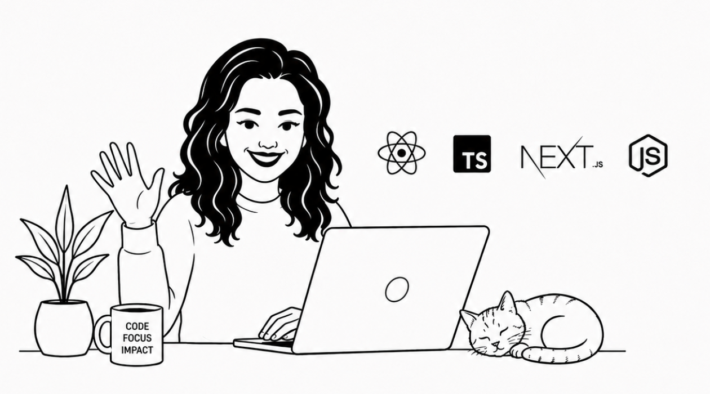

# Hey, glad you're here :)

I'm Syeda — a **Senior Frontend Engineer** and occasional indie developer.

> I like my coffee strong and my code clean, solid, and built to last.

I work primarily with **React**, **Next.js**, and **TypeScript**. My backend experience is in **Node.js** and **Express**, and I'm comfortable with both relational and non-relational databases. My preferred deployment setup is **Vercel** and **AWS**.

I'm a freelance developer with extensive experience working with clients worldwide through Upwork.

As a developer, I enjoy converting ideas into interfaces and products that actually make a difference.

---

*Currently open to new frontend roles — don't hesitate to reach out :)*

---

[Upwork](https://www.upwork.com/freelancers/syedataqvi) · [LinkedIn](https://www.linkedin.com/in/syeda-taqvi-212721419)